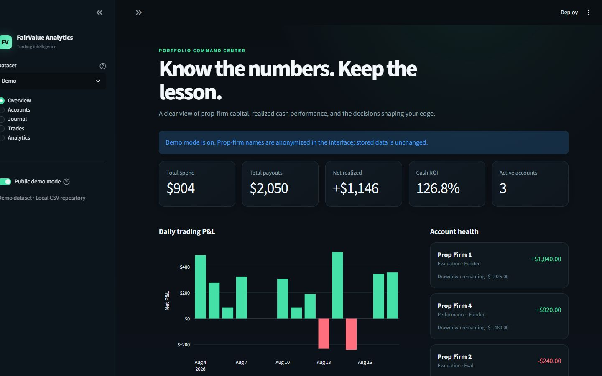
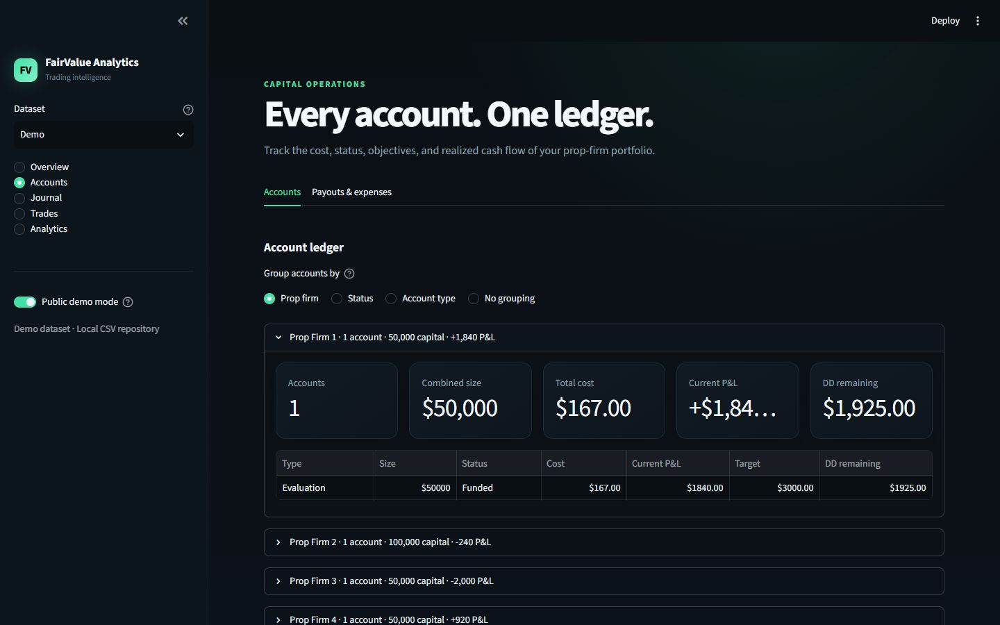
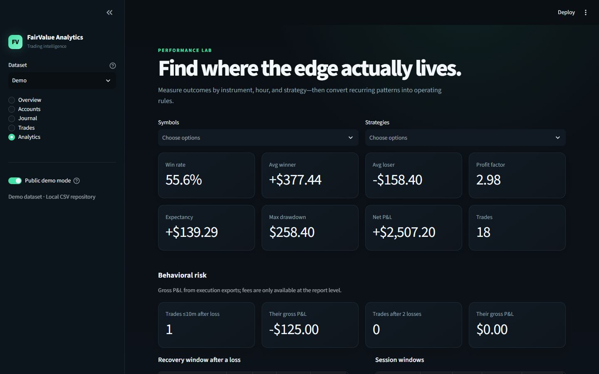
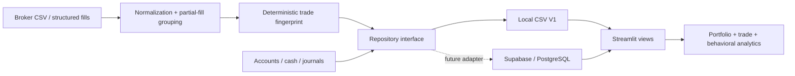

# FairValue Analytics

A local-first, AI-ready trading journal and behavioral analytics dashboard built with Python, Streamlit, Pandas, and Plotly.



## Data science case study

FairValue Analytics turns fragmented account records, cash transactions, trading fills, and qualitative journal notes into a single analytical product. The project demonstrates an end-to-end workflow: data modeling, ETL, deterministic deduplication, exploratory analysis, behavioral feature engineering, interactive visualization, testing, and privacy-aware deployment.

The included portfolio dataset is synthetic and illustrative. Personal trading records, screenshots, source reports, and source-specific import adapters are excluded from version control.

FairValue Analytics keeps the data layer separate from the interface: accounts, cash transactions, journal entries, and normalized trades live in repository-backed tables rather than in Streamlit code. The included V1 uses CSV storage for speed; the same repository contract is designed to accept a Supabase/PostgreSQL adapter later.

### Questions the product is designed to answer

- Does performance deteriorate immediately after a loss or specifically after a loss streak?
- Which symbols, strategies, and session windows carry the strongest expectancy?
- Are evaluation passes converting into funded payouts and positive realized ROI?
- Which repeated journal lessons should become measurable operating rules?

## What V1 includes

- Portfolio dashboard: total prop-firm spend, payouts, net realized cash profit, ROI, active accounts, daily P&L, account health, and recent lessons.
- Account manager: firm, account type and size, lifecycle status, purchase cost, current P&L, target, and drawdown remaining.
- Cash ledger: payouts and additional expenses, optionally linked to an account.
- Journal timeline: session debriefs, P&L, wins, mistakes, lessons, strategy/setup tags, and screenshot attachments.
- Trade importer: common Tradovate, Lucid, generic completed-trade CSVs, plus fill-level normalization when positions flatten.
- Duplicate safety: a deterministic SHA-256 trade fingerprint prevents the same trade from being imported twice.
- Analytics: win rate, average winner/loser, profit factor, expectancy, max drawdown, equity curve, P&L by symbol/hour/strategy, post-loss recovery windows, two-loss streaks, and session-window comparisons.
- Structured manual trade entry and public demo mode with display-only prop-firm anonymization.

| Account portfolio | Behavioral analytics |
| --- | --- |
|  |  |

The repository ships with illustrative sample data so every screen has useful content on first launch. Private imported data lives separately and is excluded from Git.

## Run locally

1. Install Python 3.11 or newer.
2. From this folder, create and activate a virtual environment:

   ```powershell
   py -m venv .venv
   .\.venv\Scripts\Activate.ps1
   ```

3. Install dependencies and start Streamlit:

   ```powershell
   py -m pip install -r requirements.txt
   py -m streamlit run app.py
   ```

   On macOS/Linux, use `python3` in place of `py` and activate with `source .venv/bin/activate`.

Streamlit opens the dashboard at `http://localhost:8501`.

## Project layout

```text
app.py                         Streamlit entry point and navigation
fairvalue/config.py            App constants and storage paths
fairvalue/schema.py            Stable table/column definitions
fairvalue/storage/base.py      Backend-neutral repository contract
fairvalue/storage/csv_repository.py
                               Atomic local CSV implementation
fairvalue/services/analytics.py
                               Cash and trade metric calculations
fairvalue/services/importer.py CSV mapping, fill normalization, dedupe keys
fairvalue/services/privacy.py  Display-only anonymization
fairvalue/views/               Presentation and edit/add interfaces
data/demo/                     Public-safe illustrative tables
data/private/                  Personal data and sources (git-ignored)
sample_imports/                Completed-trade and fill examples
docs/supabase_schema.sql       Proposed cloud schema
tests/                         Analytics, importer, and repository tests
```

## Data model and accounting rules

`accounts.csv` stores account purchase cost. `cash_ledger.csv` stores payouts and extra expenses such as activation or platform fees. To avoid double-counting, do not add an account's purchase cost again as an expense.

Dashboard cash metrics use:

- Total spend = account purchase costs + ledger expenses
- Total payouts = ledger payouts
- Net realized cash profit = payouts − total spend
- ROI = net realized cash profit ÷ total spend

Trading P&L is deliberately separate from realized cash profit. It comes from normalized trades and describes trading performance, while the cash ledger describes money actually spent and received.

CSV writes use a temporary file plus atomic replacement. This is suitable for one-person local use, but it is not intended as a concurrent multi-user database.

## Private and demo datasets

When private data has been imported, the sidebar exposes a **Dataset** selector:

- **Private** loads `data/private/`, which is git-ignored and intended for local personal use.
- **Demo** loads the public-safe sample records in `data/demo/`.

The separate **Public demo mode** toggle anonymizes firm names in the current presentation. It is convenient for local screenshots, but the dedicated Demo dataset is the safer source for public deployment.

## Importing trades

Use **Trades → Upload CSV**. The importer matches common case-insensitive column variants for symbol, side/action, quantity, timestamps, prices, P&L, fees, account, strategy, and setup.

- Completed-trade exports are mapped directly.
- Fill exports are processed in timestamp order with weighted-average entry price. A trade is emitted when a symbol/account position returns to flat or reverses.
- Open positions are excluded until a closing fill arrives.
- Review the normalized preview before clicking import.

If a broker export uses uncommon column names, add aliases in `fairvalue/services/importer.py`; the UI does not need to change.

## Supabase migration path

The views call `DataRepository`, not Pandas CSV functions. A future `SupabaseRepository` can implement the same five operations (`list`, `add`, `update`, `delete`, and `add_many_unique`) and be selected in `app.py` from environment configuration.

The proposed SQL is in `docs/supabase_schema.sql`. Before cloud deployment:

1. Add Supabase Auth and row-level security policies keyed by `user_id`.
2. Move screenshots to a private Storage bucket and keep only object paths in `journals`.
3. Convert comma-separated local tags to PostgreSQL arrays or normalized tag tables.
4. Add server-side validation and an import-batch table for auditability.
5. Keep the `(user_id, trade_key)` unique constraint as the final duplicate guard.

## Privacy and public demos

Public demo mode anonymizes prop-firm names at render time and does not modify the source tables. It is a presentation aid, not an authentication boundary. The repository includes a separate synthetic Demo dataset for public deployment. Do not deploy a personal local instance without authentication, row-level security, and secret management.

## Architecture



## Planned extensions

The schemas already reserve clean boundaries for voice-to-journal transcription, AI chat over history, behavioral tags, screenshot indexing, and separate private/demo deployments. These are intentionally outside the local V1 so the core journal and analytics loop stays dependable.

## Tests

```powershell
py -m pytest
```

The tests cover cash accounting, trading metrics, drawdown, completed-trade mapping, fill normalization, repository CRUD, and duplicate rejection.
