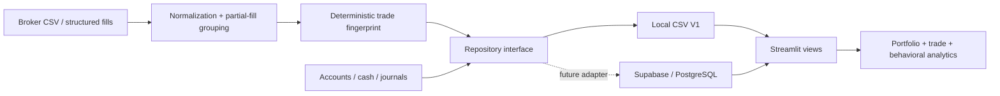

# FairValue Analytics

A personal trading journal and behavioral analytics dashboard built with Python, Streamlit, Pandas, and Plotly.


## Why I built this

I have been trading for a while, and one problem kept standing out: I could make it through prop-firm evaluations, but reaching a payout consistently was much harder. I wanted to stop relying only on memory and start asking better questions with data.

FairValue Analytics brings my account history, trading executions, expenses, payouts, and journal lessons into one place. My main question is not simply, "Which setup wins most often?" It is, "What changes in my decision-making after a loss, after passing an evaluation, or when funded-account pressure increases?"

The included portfolio dataset is synthetic and illustrative. Personal trading records, screenshots, source reports, and source-specific import adapters are excluded from version control.

## Where I am in my data journey

I am currently studying the fundamentals of data science and machine learning. This project is how I am connecting those classes to a subject I already know and care about. I am learning how to clean data, create useful features, compare groups, visualize results, question small samples, and turn observations into testable rules.

This was built with AI-assisted development. I defined the problem, supplied and checked the trading context, chose the questions and metrics, and decided whether the results made sense from a trader's perspective. AI helped me turn those decisions into a modular application and explain unfamiliar software concepts as I worked through them.

The code keeps data separate from the interface: accounts, cash transactions, journal entries, and normalized trades live in repository-backed tables rather than inside the Streamlit pages. V1 uses CSV storage because it is easy to inspect while I learn. A future version can use Supabase/PostgreSQL without rewriting the dashboard.

### Questions the product is designed to answer

- Does performance deteriorate immediately after a loss or specifically after a loss streak?
- Which symbols, strategies, and session windows carry the strongest expectancy?
- Are evaluation passes converting into funded payouts and positive realized ROI?
- Which repeated journal lessons should become measurable operating rules?

My current working hypothesis is that the largest problem is not one losing trade by itself. It is the deterioration in patience and selectivity after two consecutive losses. The public demo uses synthetic trades to show how I am testing that idea without publishing my personal results.

## What V1 includes

- Portfolio dashboard: total prop-firm spend, payouts, net realized cash profit, ROI, active accounts, daily P&L, account health, and recent lessons.
- Account manager: firm, account type and size, lifecycle status, purchase cost, current P&L, target, and drawdown remaining.
- Cash ledger: payouts and additional expenses, optionally linked to an account.
- Journal timeline: session debriefs, P&L, wins, mistakes, lessons, strategy/setup tags, and screenshot attachments.
- Trade importer: common Tradovate, Lucid, generic completed-trade CSVs, plus fill-level normalization when positions flatten.
- Duplicate safety: a deterministic SHA-256 trade fingerprint prevents the same trade from being imported twice.
- Analytics: win rate, average winner/loser, profit factor, expectancy, max drawdown, equity curve, P&L by symbol/hour/strategy, post-loss recovery windows, two-loss streaks, and session-window comparisons.
- Structured manual trade entry and public demo mode with display-only prop-firm anonymization.

| Account portfolio | Behavioral analytics |
| --- | --- |
|  |  |

The repository ships with illustrative sample data so every screen has useful content on first launch. Private imported data lives separately and is excluded from Git.

## What I understand and can explain

- **Rows and columns:** each account, cash transaction, journal entry, and completed trade becomes a structured record.
- **Cleaning:** timestamps and currency values need consistent types before they can be compared.
- **Grouping:** Pandas `groupby` lets me compare symbols, strategies, session windows, and behavioral conditions.
- **Feature engineering:** `after_two_losses` is a new variable created from the order of previous trade results.
- **Trading metrics:** win rate alone is incomplete, so the dashboard also measures average wins/losses, expectancy, profit factor, and drawdown.
- **Cash versus performance:** trading P&L measures execution results; realized cash profit measures payouts minus actual prop-firm spending.
- **Uncertainty:** a pattern in a small personal sample is a hypothesis to test, not proof that a rule will always work.

The beginner-friendly notebook in [`notebooks/01_behavioral_trading_analysis.ipynb`](notebooks/01_behavioral_trading_analysis.ipynb) rebuilds the main behavioral comparison with basic Pandas operations. [`docs/project_walkthrough.md`](docs/project_walkthrough.md) is the plain-language explanation I use to review the project or prepare for an interview.

## Run locally

1. Install Python 3.11 or newer.
2. From this folder, create and activate a virtual environment:

   ```powershell
   py -m venv .venv
   .\.venv\Scripts\Activate.ps1
   ```

3. Install dependencies and start Streamlit:

   ```powershell
   py -m pip install -r requirements.txt
   py -m streamlit run app.py
   ```

   On macOS/Linux, use `python3` in place of `py` and activate with `source .venv/bin/activate`.

Streamlit opens the dashboard at `http://localhost:8501`.

## Project layout

```text
app.py                         Streamlit entry point and navigation
fairvalue/config.py            App constants and storage paths
fairvalue/schema.py            Stable table/column definitions
fairvalue/storage/base.py      Backend-neutral repository contract
fairvalue/storage/csv_repository.py
                               Atomic local CSV implementation
fairvalue/services/analytics.py
                               Cash and trade metric calculations
fairvalue/services/importer.py CSV mapping, fill normalization, dedupe keys
fairvalue/services/privacy.py  Display-only anonymization
fairvalue/views/               Presentation and edit/add interfaces
data/demo/                     Public-safe illustrative tables
data/private/                  Personal data and sources (git-ignored)
sample_imports/                Completed-trade and fill examples
notebooks/                     Beginner-friendly Pandas analysis
docs/supabase_schema.sql       Proposed cloud schema
docs/project_walkthrough.md    Plain-language project explanation
tests/                         Analytics, importer, and repository tests
```

## Data model and accounting rules

`accounts.csv` stores account purchase cost. `cash_ledger.csv` stores payouts and extra expenses such as activation or platform fees. To avoid double-counting, do not add an account's purchase cost again as an expense.

Dashboard cash metrics use:

- Total spend = account purchase costs + ledger expenses
- Total payouts = ledger payouts
- Net realized cash profit = payouts − total spend
- ROI = net realized cash profit ÷ total spend

Trading P&L is deliberately separate from realized cash profit. It comes from normalized trades and describes trading performance, while the cash ledger describes money actually spent and received.

CSV writes use a temporary file plus atomic replacement. This is suitable for one-person local use, but it is not intended as a concurrent multi-user database.

## Private and demo datasets

When private data has been imported, the sidebar exposes a **Dataset** selector:

- **Private** loads `data/private/`, which is git-ignored and intended for local personal use.
- **Demo** loads the public-safe sample records in `data/demo/`.

The separate **Public demo mode** toggle anonymizes firm names in the current presentation. It is convenient for local screenshots, but the dedicated Demo dataset is the safer source for public deployment.

## Importing trades

Use **Trades → Upload CSV**. The importer matches common case-insensitive column variants for symbol, side/action, quantity, timestamps, prices, P&L, fees, account, strategy, and setup.

- Completed-trade exports are mapped directly.
- Fill exports are processed in timestamp order with weighted-average entry price. A trade is emitted when a symbol/account position returns to flat or reverses.
- Open positions are excluded until a closing fill arrives.
- Review the normalized preview before clicking import.

If a broker export uses uncommon column names, add aliases in `fairvalue/services/importer.py`; the UI does not need to change.

## Supabase migration path

The views call `DataRepository`, not Pandas CSV functions. A future `SupabaseRepository` can implement the same five operations (`list`, `add`, `update`, `delete`, and `add_many_unique`) and be selected in `app.py` from environment configuration.

The proposed SQL is in `docs/supabase_schema.sql`. Before cloud deployment:

1. Add Supabase Auth and row-level security policies keyed by `user_id`.
2. Move screenshots to a private Storage bucket and keep only object paths in `journals`.
3. Convert comma-separated local tags to PostgreSQL arrays or normalized tag tables.
4. Add server-side validation and an import-batch table for auditability.
5. Keep the `(user_id, trade_key)` unique constraint as the final duplicate guard.

## Privacy and public demos

Public demo mode anonymizes prop-firm names at render time and does not modify the source tables. It is a presentation aid, not an authentication boundary. The repository includes a separate synthetic Demo dataset for public deployment. Do not deploy a personal local instance without authentication, row-level security, and secret management.

## Limitations

- The public records are synthetic and demonstrate the method rather than my personal profitability.
- My private dataset represents one trader and is still relatively small.
- The behavioral comparisons are descriptive; they do not establish cause and effect.
- Fees are not available at the individual-trade level in every export, so some behavioral views use gross P&L.
- The two-loss lockout should be evaluated on future trades that were not used to form the original hypothesis.

## Architecture



## Planned extensions

The schemas already reserve clean boundaries for voice-to-journal transcription, AI chat over history, behavioral tags, screenshot indexing, and separate private/demo deployments. These are intentionally outside the local V1 so the core journal and analytics loop stays dependable.

## Tests

```powershell
py -m pytest
```

The tests cover cash accounting, trading metrics, drawdown, completed-trade mapping, fill normalization, repository CRUD, and duplicate rejection.
